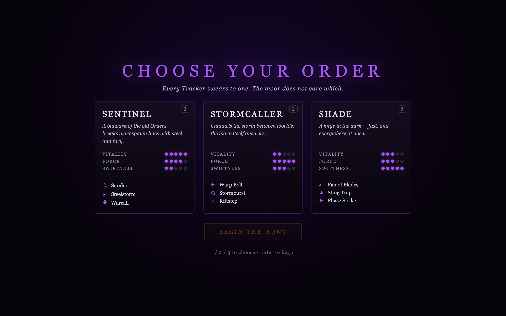
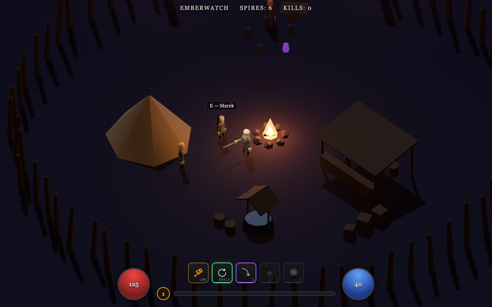
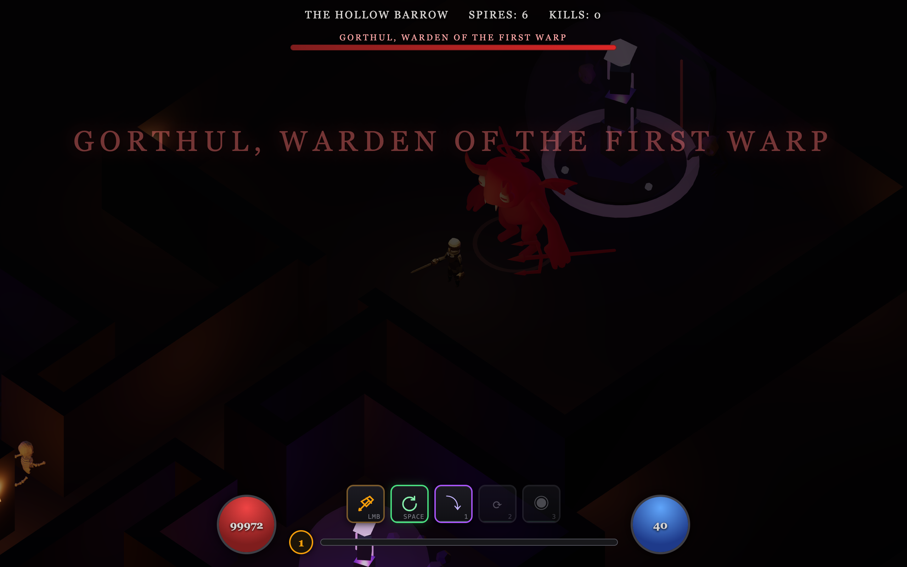

# Warptracker

**A fully open source, community-driven action RPG in the browser — a love letter to Diablo II.**

Streams of evil — *warps* — are tearing into the world. You are the **Tracker**: swear to an Order, take your first hunt at the Emberwatch fire, and follow the old road into the Blackfen Moor. Kill the keepers, break the wards, shatter the Warpspires. Something beneath the Hollow Barrow is holding the doors open.

**Play it now: [warptracker.com](https://warptracker.com)** — no install, no account, no ads. Loads in seconds.

   



## The game

Real action combat — not click-and-wait:

- **WASD** to move, **mouse** to aim, **click** for 3-hit sword combos with a heavy finisher, **SPACE** to dodge roll with i-frames. Enemies telegraph everything; everything is dodgeable.
- **Three Orders** (classes), each with three skills on 1/2/3 and a mana globe: the **Sentinel** (leap slam, whirling steel, war cry), the **Stormcaller** (warp bolts, novas, *teleport*), the **Shade** (fans of blades, traps, phase dashes).
- **Emberwatch**, a palisaded safe town: quest-giving warden, a lorekeeper by the fire who'd like you to sit awhile, a healer, a smith.
- **The Blackfen Moor** and its escalating depths, dotted with **Warpspires** — warded obsidian totems guarded by warpspawn packs. Kill the pack, break the ward, smash the spire.
- **The Hollow Barrow**: a torchlit dungeon crawl ending at the Warpheart and **Gorthul, Warden of the First Warp**.
- Quests, XP, levels, saves, repeatable end-game Hunts.




## Founding principles

1. **Fully open source.** MIT licensed, forever — engine, game design, balance numbers, everything in this repo.
2. **Fully free assets.** Everything is procedural code or CC0 ([Quaternius](https://quaternius.com) characters; world, VFX, and all audio are generated). Policy: [ASSETS.md](ASSETS.md).
3. **Community driven.** The roadmap is issues and discussions. Want a feature? Propose it or build it.

## Development

```sh
bun install       # or npm/pnpm install
bun run dev       # local dev server
bun run build     # typecheck + production build
```

Deployment is a Cloudflare Worker serving static assets (`bun run deploy`). Design docs for the current act live in [docs/DESIGN-v0.3.md](docs/DESIGN-v0.3.md).

## Contributing

All contributions welcome — code, game design, balance tuning, art (CC0 only), sound, docs. See [CONTRIBUTING.md](CONTRIBUTING.md). Debug handles for tinkering: `window.__WT` (game instance) and `window.__WTdebug`.

## Roadmap (community-shaped)

- [x] Action combat, dodge rolls, telegraphs
- [x] Town, quests, NPCs, dungeon, boss
- [x] Classes, skills, mana
- [x] Loot with rarities (in progress this week)
- [ ] Act II — the stream runs deeper
- [ ] More classes, skill trees, respec
- [ ] Co-op multiplayer (regional realm servers — community-hostable)
- [ ] Controller + mobile support

## License

[MIT](LICENSE). Assets policy: [ASSETS.md](ASSETS.md).
